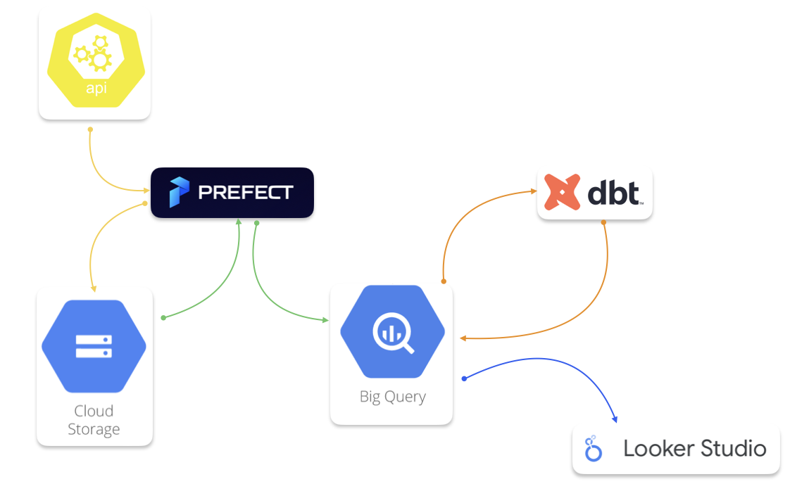
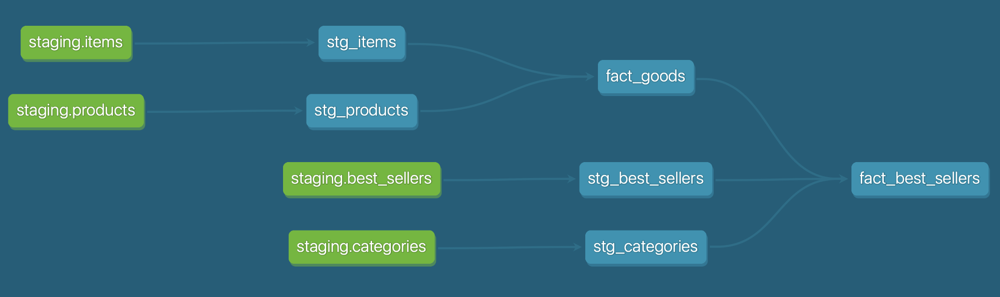

# MLA_Dashboard

# Problem description

Market platforms like Mercado Libre Argentina have millions of products listed on their platform, making it difficult for shoppers to find the most popular and best-selling products. Also, with the sheer number of products on the platform, it can be overwhelming for sellers to keep track of how their own product is performing against its competitors. This project aims to solve this problem by creating a board that shows the 20 best-selling products by category in Mercado Libre Argentina. This will help both buyers and sellers to easily track and analyze the performance of products in their respective categories.

The dashboard will allow users to filter products by category and rating within each category, and will also display the number of products sold and their respective prices. Additionally, users will be able to view the total gross sales of each product in Argentine pesos. With this dashboard, both buyers and sellers can easily identify the most popular products in a given category and track their sales performance over time.

## Diagram

## dbt Transformation

## Final Result
IMAGEN

## DWH
Currently, the data warehouse (DWH) is not optimized by partitioning and clustering, since the tables are not expected to grow in size and currently the largest table handled has only 567 rows.

## How to reproduce this project

