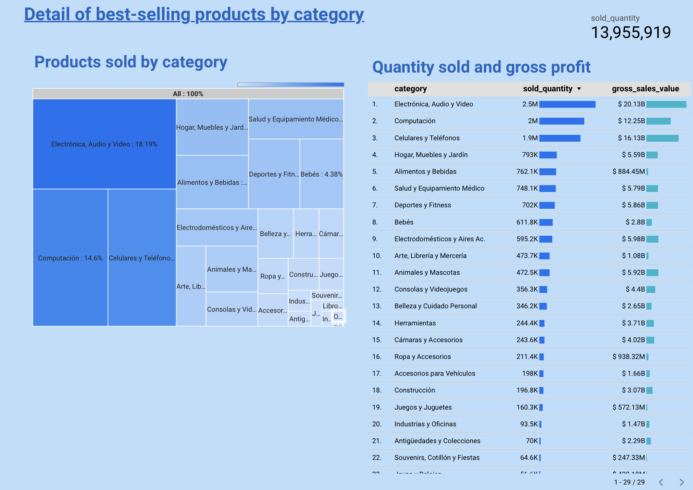
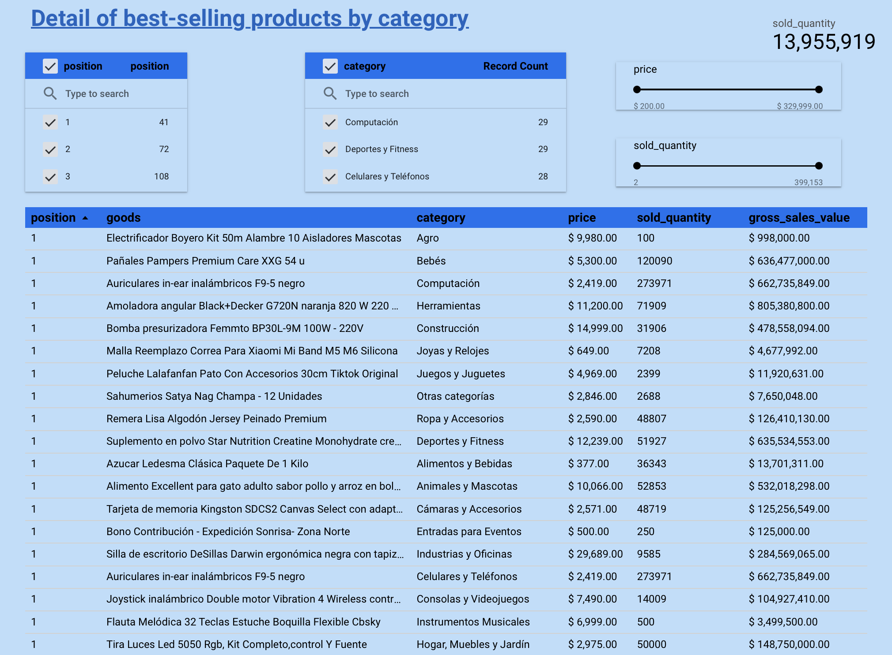
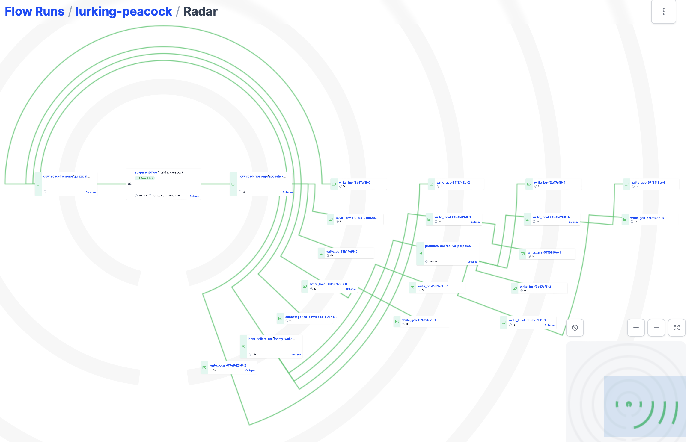

# MLA_Dashboard

# Problem description

Market platforms like Mercado Libre Argentina have millions of products listed on their platform, making it difficult for shoppers to find the most popular and best-selling products. Also, with the sheer number of products on the platform, it can be overwhelming for sellers to keep track of how their own product is performing against its competitors. This project aims to solve this problem by creating a board that shows the 20 best-selling products by category in Mercado Libre Argentina. This will help both buyers and sellers to easily track and analyze the performance of products in their respective categories.

The dashboard will allow users to filter products by category and rating within each category, and will also display the number of products sold and their respective prices. Additionally, users will be able to view the total gross sales of each product in Argentine pesos. With this dashboard, both buyers and sellers can easily identify the most popular products in a given category and track their sales performance over time.

## Diagram


## dbt Transformation


## Final Result



View the [online dashboard](https://lookerstudio.google.com/s/vXzwPBAAXHw)

### DWH
Currently, the data warehouse (DWH) is not optimized by partitioning and clustering, since the tables are not expected to grow in size and currently the largest table handled has only 567 rows.

## How to reproduce this project

1. Initial setup:
```
cd Projects
git clone https://github.com/mary435/MLA_Dashboard.git
cd MLA_Dashboard
```

1. Connect to the MLA API. Follow these [steps](How_api_connect.md).

2. Activate your environment and install the [requirements](requirements.txt).
``` 
conda activate mla_dashboard
pip install -r requirements.txt
```
3. Start prefect server
``` 
prefect orion start
```
4. Open up your browser to http://127.0.0.1:4200 to get started. 

5. Folow these [steps](how_connect_gcs.md) to connect prefect to gcs.

6. To create the deployment, run the following command. Which will create the file etl_parent_flow-deployment.yaml and will create the deployment in prefect with the name etl_MLA, scheduled to run daily at 1:00 p.m.:
```
prefect deployment build etl_web_to_gcs_bq.py:etl_parent_flow -n etl_MLA --cron "0 13 * * *" -a
```
7. Start the default woker agent:
```
prefect agent start  --work-queue "default"
```
8. The script runs a parent flow and four child flows, with different tasks. This script communicates with the API, downloads the information to a parquet file and saves it first in a bucket and then in the DWH.
This is what the radar of the flows looks like:


9.  Create the datasets "dbt_sandbox," "production," and "staging" in BigQuery.
10. For the dbt transformation clone a new repository:
```
git clone https://github.com/mary435/MLA_dbt.git
```
11. Create a new account in dbt. And Connect dbt to BigQuery and the new repository then initialize the project. Folow these [steps](how_connect_dbt.md)
12. Run this command in dbt and you will see how the views and tables go to the bigquery sandbox.
```
dbt run
```
13. Now run this command in dbt and you will see how the views and tables go to bigquery production and the documentation tab is enabled in dbt with the information of the tables.
```
dbt build
```
14. Configure dbt to update the data automatically every day. Folow these [steps](how_connect_dbt.md).
15. Open now datadtudio or lookerstudio. Select create in the upper left corner.And choose the option "Data Source".
16. Here choose BigQuery and the project name "mla-dashboard-zoom", then the dataset "production" and the table "fact_best_sellers" and now click connect. Now you are ready here you can create the dashboard!


## Licence 
Distributed under the terms of the [MIT](https://opensource.org/license/mit/) license, "MLA_Dashboard" is free and open source software.
